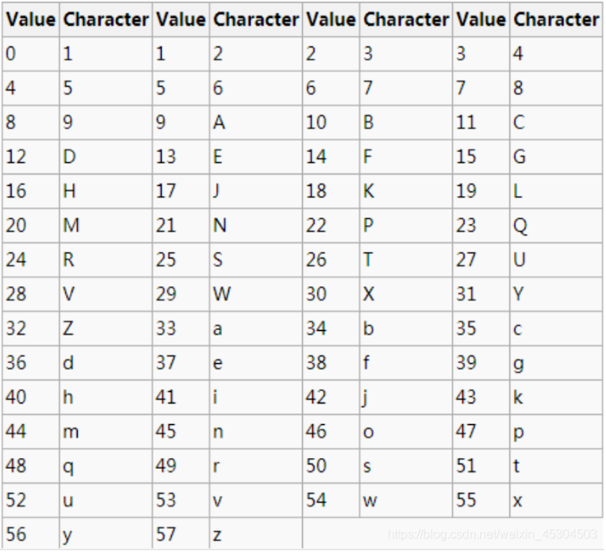
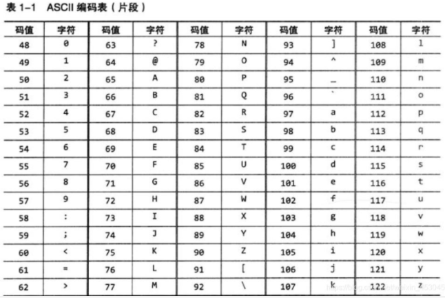

## 一、Base编码

##### 1、base64
```26个小写字母、26个大写字母、10个数字、/、+```
##### 2、base58(区块链)
```去掉6个容易混淆的，去掉0，大写的O、大写的I、小写的L、/、+/、+影响双击选择```
##### 3、base58编码表

##### 4、base58的编码过程

* ```将字符串的每个字节换算成ASCII，字符串实际上就是256进制的数字组合```
* ```将256进制的数字转换成10进制数字```
* ```将10进制数字转换成58进制数字（除以58，每次得到的余数就是对应的58进制，0用编码1来代表）```
* ```将58进制数字对照58编码表找到对应的字符```